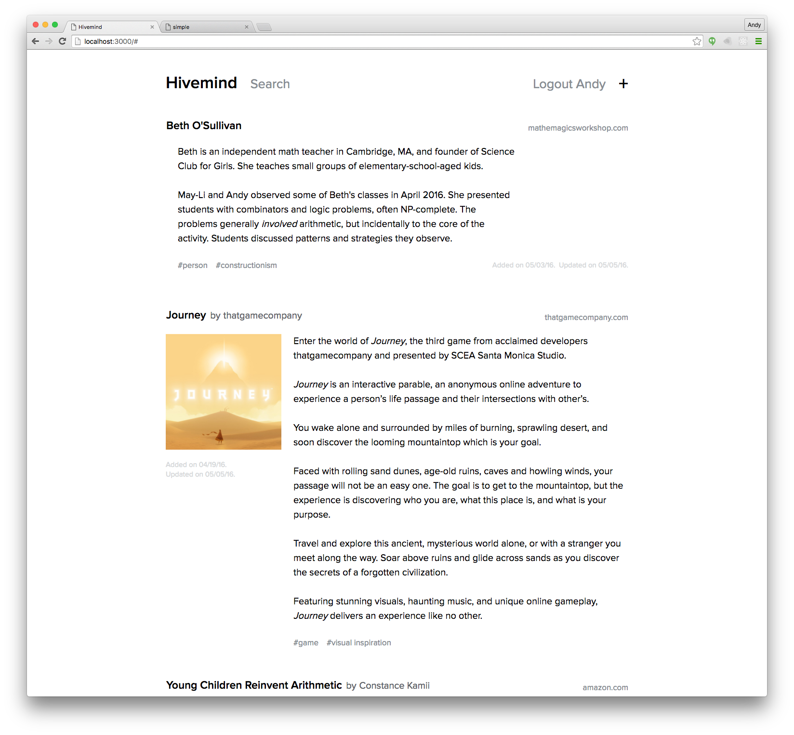

# Hivemind

Hivemind is an experimental knowledge-management system built to help Khan Academy's Long-term Research group share intellectual context.

In the course of our research, we review lots of papers, books, games, toys, etc. We’re mining for quotes, great ideas, other promising resources, inspiration. When we find something great, that becomes part of our research team’s shared intellectual context—one of the most valuable things we build!



Disclaimers: The project is still very young, and it's probably not useful outside of Khan Academy. It's still in a rough prototype stage, intentionally not yet robustly architected.

## Running a local server

First, [install Meteor](https://www.meteor.com/install): `curl https://install.meteor.com/ | sh`

This app requires valid credentials for Amazon S3, Google OAuth, and SMTP.

If you're at Khan Academy, copy the [secrets from Phabricator](https://phabricator.khanacademy.org/K145) into `settings.json` in the root of the project directory. If you're not, modify `settings.template.json` to use your secrets.

Install local dependencies with `npm install`

Run a local server with `meteor --settings settings.json`.

## Deploying to heroku

Aside from a heroku account, you need mongodb and a heroku buildpack to get hivemind working for yourself. Create a new app on heroku, let's pretend you called it **hivehive**. This section assumes no knowledge of heroku. You will need to install the [heroku toolbelt](https://toolbelt.heroku.com/) to run command line heroku commands instead of using their web interface to `init`.

1. For the buildpack, you will want *[the one with the horse](https://github.com/AdmitHub/meteor-buildpack-horse)*. You can set it up by typing the following in the project dir:

    ```shell
    heroku buildpacks:set https://github.com/AdmitHub/meteor-buildpack-horse.git
    ```

    optionally, you can set that url in the `settings` tab of your app via the heroku dashboard

1. For mongo, you can use the **mLab Mongo** add-on at the **sandbox** tier (up to 500MB) for free (but you may need to verify your heroku acct using a credit card). You'll get a url for connecting to mongo. mLab will add a mongo url to your heroku project's environmental variables. The *horse buildpack* prefers the `MONGO_URL` environmental variable but you can use `MONGODB_URI`.

1. The `ROOT_URL` environmental variable will be `https://hivehive.herokuapp.com/` yes, the protocol is http**s**.

1. To deploy via git, you can add heroku as a remote like so

    ```shell
    heroku git:remote -a hivehive
    # or via git proper
    git add remote heroku https://git.heroku.com/hivehive.git
    ```

1. Copy your `settings.json` file into the `METEOR_SETTINGS` environmental variable in the heroku dashboard.

1. To actually deploy, you "simply" push to the heroku master branch, like so:

    ```shell
    git push heroku master
    ```

    This process easily takes a few minutes at best. Have a lemonade.

The site will now work, but you will need to make sure that your [s3 bucket is world-readable](http://stackoverflow.com/a/4709391/470756). If not, hivemind will successfully upload media to your bucket (assuming your iam access/secrets are good and the [policy you assigned](https://aws.amazon.com/blogs/security/writing-iam-policies-how-to-grant-access-to-an-amazon-s3-bucket/) to your user is valid), but your meteor server will be full of apparently broken links.

If you are looking for a free smtp service, mailgun has a *very generous* free tier.


## Deploying to Khan Academy's Hivemind instance

(Intentionally not yet linking to the instance publicly—still evolving…)

The Long-term Research Hivemind currently runs on Heroku. Ask [Andy](mailto:andy@khanacademy.org) for push access, then:

1. [Install the Heroku toolbelt](https://toolbelt.heroku.com/).
2. Add Heroku's remote in your git checkout: `heroku git:remote -a ka-hivemind`
3. Push your branch to Heroku: `git push origin heroku`
